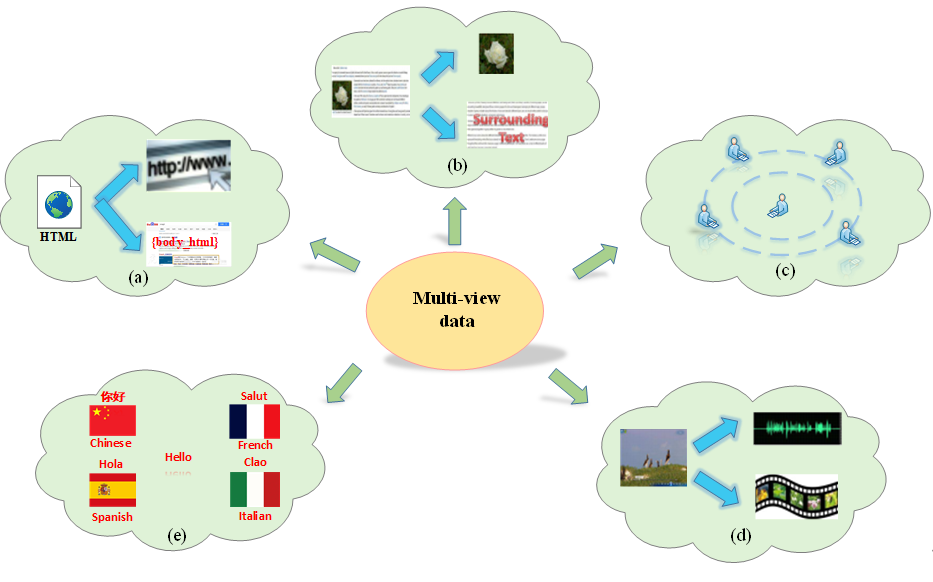

# A Survey and an Empirical Evaluation of Multi-view Clustering Approaches

This reporsity is a collection of state-of-the-art (SOTA), novel incomplete and complete multi-view clustering (papers,
codes and datasets). Any problems, please contact lhzhou@ynu.edu.cn, dugking@mail.ynu.edu.cn and lu983760699@gmail.com.
If you find this repository useful to your research or work, it is really appreciated to star this repository. :heart:

- [PRELIMINARIES]
  - [What's Multi-view data?]
  - [What's Incomplete Multi-view data?]
  - [What's Multi-view clustering?]
  - [What's incomplete Multi-view clsutering?]
  - [Principles related to MVC]
- [Survey papers]
- [Papers]
    - [The information fusion strategy]
        - [early-fusion]
        - [Late fusion]
    - [The clustering routine]
        - [One-step routine]
        - [two-step routine]
    - [The weighting strategy]
    - [COMPLETE MULTI-VIEW CLUSTERING]
        - [Spectral clustering-based approaches]
        - [Co-regularization and co-training spectral clustering]
        - [Constrained spectral clustering]
        - [Fast spectral clustering]
        - [NMF-based approaches]
        - [Fast NMF]
        - [Deep NMF]
        - [Multiple kernel learning]
        - [Graph learning]
        - [Embedding learning]
        - [Alignment learning]
        - [Subspace learning]
        - [Self-paced learning]
        - [Co-Clustering-based approaches]
        - [Multi-task-based approaches]
    - [Incomplete Multi-view clustering]
        - [Imputation-based IMVC Incomplete Multi-view clustering]
        - [Transformation-based IMVC]
        - [The unified IMVC]
        - [Uncertain multi-view clustering]
        - [Incremental multi-view clustering]
    - [Code]
    - [Benchmark Datasets]
        - [Text Datasets]
        - [Image Datasets]
        - [Rest of data (Text-gene、Image-text and Video)]

--------------
## What's Multi-view data?

Multi-view data means that the same sample is described from different perspectives, and each perspective describes a
class of features of the sample, called a view. In other words, the same sample can be represented by multiple
heterogeneous features and each feature representation corresponds to a
view. [Xu, Tao et al. 2013](https://arxiv.org/abs/1304.5634) provided an intuitive example, where a) a web document is
represented by its url and words on the page, b) a web image is depicted by its surrounding text separate to the visual
information, c) images of a 3D sample taken from different viewpoints, d) video clips are combinations of audio signals
and visual frames, e) multilingual documents have one view in each language.

    
    
    Figure 1: multi-view data

--------------

## What's Incomplete Multi-view data?

Multi-view data may be complete or incomplete. The complete multi-view data means that each feature has been collected
and each sample appears in each view, while incomplete multi-view data indicates that some data samples could be missing
their observation on some views (i.e., missing samples) or could be available only for their partial features (i.e.,
missing feature). [(Zhao, Lyu et al. 2022)](https://link.springer.com/article/10.1007/s10489-021-02417-z) gave several
specific examples, for example, in multi-lingual documents clustering task, documents are translated into different
languages to denote different views, but many documents may have only one or two language versions due to the
difficulties to obtain documents in each language; in social multimedia, some sample may miss visual or audio
information due to sensor failure; in health informatics, some patients may not take certain lab tests to cause missing
views or missing values; in video surveillance, some views are missing due to the cameras for these views are out of
action or suffer from occlusions. [(Zong, Miao et al. 2021)](https://doi.org/10.1016/j.knosys.2020.106615) also
considered the case of missing clusters, i.e. some clusters may be missing in some views. Figure 2 illustrates the cases
of missing samples and missing clusters, where the samples in the same cluster are represented by the same shape but
distinguished by color, the marker “×” means missing samples and missing clusters. In Figure 2. (a), clusters and
instances are complete; in Figure 2. (b), clusters are complete but four samples are missing; while in Figure 2. (c),
two clusters and two samples are missing.

    
    

--------------

## What's Multi-view clustering?

Multi-view clustering (MVC) aims to group samples (objects/instances/points) with similar structures or patterns into
the same group (cluster) and samples with dissimilar ones into different groups by combining the available feature
information of different views and searching for consistent clusters across different views.

    
    

--------------

## What's incomplete Multi-view clsutering?

For these multi-view clustering methods, they commonly require that all views of data are complete. However, the
requirement is often impossible to satisfy because it is often the case that some views of samples are missing in the
real-world applications, especially in the applications of disease diagnosing and webpage clustering. This incomplete
problem of views leads to the failure of the conventional multi-view methods. The problem of clustering incomplete
multi-view data is known as incomplete multi-view clustering (IMVC) (or partial multi-view clustering) (Hu and Chen
2019). The purpose of IMVC is to group these multi-view data points with incomplete feature views into different
clusters by using the observed data instances in different views. IMVC consists of missing multi-view clustering,
uncertain multi-view clustering, and incremental multi-view clustering.

--------------

## Principles related to MVC

There are two significant principles ensuring the effectiveness of MVC: consensus and complementary
principles [Xu, Tao et al. 2013](https://arxiv.org/abs/1304.5634). The consistent of multi-view data means that there is
some common knowledge across different views (e.g. both two pictures about dogs have contour and facial features), while
the complementary of multi-view data refers to some unique knowledge contained in each view that is not available in
other views (e.g. one view shows the side of a dog and the other shows the front of the dog, these two views allow for a
more complete depiction of the dog). Therefore, the consensus principle aims to maximize the agreement across multiple
distinct views for improving the understanding of the commonness of the observed samples, while the complementary
principle states that in a multi-view context, each view of the data may contain some particular knowledge that other
views do not have, and this particular knowledge can mutually complement to each other. (Yang and Wang 2018) illustrated
intuitively the complementary and consensus principles by mapping a data sample with two views into a latent data space,
where part A and part C exist in view 1 and view 2 respectively, indicating the complementarity of two views; meanwhile,
part B is shared by both views, showing the consensus between two views.

    
    

--------------

# Papers

<a name="surveypapers" />

## Survey papers

1. **A survey on multi-view clustering** \[[paper](https://arxiv.org/abs/1712.06246v2)]

2. **A survey of multi-view representation learning** \[[paper](https://ieeexplore.ieee.org/document/8471216)]

3. **A survey of multi-view machine learning** \[[paper](www.cst.ecnu.edu.cn/~slsun/pubs/MVML_final.pdf)]

4. **A Survey on Multi-view Learning** \[[paper](https://arxiv.org/abs/1304.5634 )]

5. **Multi-view clustering: A survey** \[[paper](https://ieeexplore.ieee.org/document/8336846)]

# The information fusion strategy

The strategies for fusing information from multiple views can be divided into three categories: direct-fusion,
early-fusion, and late-fusion according to the fusion stage. They are also called data level, feature level, and
decision level fusion respectively, i.e. fusion in the data, fusion in the projected features, and fusion in the
results. The direct-fusion approaches directly incorporate multi-view data into the clustering process through
optimizing some particular loss functions.

## early-fusion：

The early-fusion is to fuse multiple features or graph structure representations of multi-view data into a single
representation or a consensus affinity graph across multiple views, and then any known single-view clustering
algorithm (such as k-means) can be applied to partition data samples.

### Late fusion：

The approaches of the late fusion first perform data clustering on each view and then fuse the results for all the views
to obtain the final clustering results according to consensus. Late fusion can further be divided into integrated
learning and collaborative training. The input to the integrated clustering algorithm is the result of clustering
corresponding to multiple views

# The clustering routine

# One-step routine

The one-step routine integrates representation learning and clustering task into a unified framework, which
simultaneously learns a graph for each view, a partition for each view, and a consensus partition. Based on an iterative
optimization strategy, the high-quality consensus clustering results can be obtained directly and are employed to guide
the graph construction and the updating of basic partitions, which later contributes to a new consensus partition. The
joint optimization co-trains the clustering together with representation learning, leveraging the inherent interactions
between two tasks and realizing the mutual benefit of these two steps. In one-step routine, the cluster label of each
data point can be directly assigned and does not need any post-processing, decreasing the instability of the clustering
performance induced by the uncertainty of post-processing operation

### Two-step routine

The two-step routine first extracts the low-dimensional representation of multi-view data and then uses traditional
clustering approaches
(such as k-means) to process the obtained representation. That is to say, the two-step routine often needs a
post-processing process, i.e. applying a simple clustering method on the learned representation or carrying out a fusion
operation on the clustering results of individual views, to produce the final clustering results.

# The weighting strategy

1. Self-weighted Multiview Clustering with Multiple Graphs
   \[[paper](https://www.ijcai.org/proceedings/2017/0357.pdf)|[code](https://github.com/kylejingli/SwMC-IJCAI17)]

2. Multiview spectral embedding
   \[[paper](https://ieeexplore.ieee.org/stamp/stamp.jsp?tp=&arnumber=5415552)|[code](https://github.com/rciszek/mse)] 

3. Multi-view content-context information bottleneck for image clustering
   \[[paper](https://doi.org/10.1016/j.eswa.2021.115374)|[code]

4. Parameter-free auto-weighted multiple graph learning: a framework for multiview clustering and semi-supervised
   classification
   \[[paper](https://www.ijcai.org/Proceedings/16/Papers/269.pdf)|[code](https://github.com/kylejingli/AMGL-IJCAI16)]

5. 基于两级权重的多视角聚类 \[[paper](https://crad.ict.ac.cn/CN/10.7544/issn1000-1239.20200897)|[code]

6. Confidence level auto-weighting robust multi-view subspace clustering
   \[[paper](https://doi.org/10.1016/j.neucom.2021.12.029)|[code]

7. Weighted multi-view clustering with feature selection \[[paper](https://doi.org/10.1016/j.patcog.2015.12.007)|[code]

8. Two-level weighted collaborative k-means for multi-view clustering
   \[[paper](https://doi.org/10.1016/j.knosys.2018.03.009)|[code](https://github.com/dugzzuli/code-of-TW-Co-kmeans)]

9. Weighted multi-view co-clustering (WMVCC) for sparse data
   \[[paper](https://doi.org/10.1007/s10489-021-02405-3)|[code]

10. A cluster-weighted kernel K-means method for multi-view
    clustering\[[paper](https://ojs.aaai.org/index.php/AAAI/article/view/5922)|[code]

11. Multi-graph fusion for multi-view spectral clustering
    \[[paper](https://doi.org/10.1016/j.knosys.2019.105102)|[code](https://github.com/sckangz/GFSC)]

12. 一种双重加权的多视角聚类方法 \[[paper](https://cjc.ict.ac.cn/online/onlinepaper/08177-胡世哲-202094103146.pdf)|[code]

13. View-Wise Versus Cluster-Wise Weight: Which Is Better for Multi-View
    Clustering?\[[paper](https://ieeexplore.ieee.org/stamp/stamp.jsp?tp=&arnumber=9623366)|[code]

# COMPLETE MULTI-VIEW CLUSTERING

<!-- 1.  \[[paper]()|[code]] -->

## Spectral clustering-based approaches

1. Multi-view clustering via canonical correlation analysis \[[paper](https://doi.org/10.1145/1553374.1553391)|[code]

2. Multi-view kernel spectral clustering \[[paper](https://doi.org/10.1016/j.inffus.2017.12.002)|[code]

3. Correlational spectral clustering \[[paper](https://doi.org/10.1109/CVPR.2008.4587353)|[code]

## Co-regularization and co-training spectral clustering

1. Co-regularized multi-view spectral
   clustering\[[paper](https://proceedings.neurips.cc/paper/2011/hash/31839b036f63806cba3f47b93af8ccb5-Abstract.html)|[code](https://github.com/lkrmbhlz/CRMVSC)]

2. A co-training approach for multi-view spectral
   clustering\[[paper](http://citeseerx.ist.psu.edu/viewdoc/download?doi=10.1.1.221.6302&rep=rep1&type=pdf)|[code]

3. Combining labeled and unlabeled data with co-training\[[paper](https://doi.org/10.1145/279943.279962)|[code]

## Constrained spectral clustering

1. Heterogeneous image feature integration via multi-modal spectral
   clustering\[[paper](https://doi.org/10.1109/CVPR.2011.5995740)|[code]

2. Robust multi-view spectral clustering via low-rank and sparse decomposition
   \[[paper](http://www.aaai.org/ocs/index.php/AAAI/AAAI14/paper/view/8135)|[code]

3. Multiview clustering via adaptively weighted procrustes\[[paper](https://doi.org/10.1145/3219819.3220049)|[code]

4. One-step multi-view spectral clustering\[[paper](https://doi.org/10.1109/TKDE.2018.2873378)|[code]]

5. Multi-graph fusion for multi-view spectral
   clustering\[[paper](https://doi.org/10.1016/j.knosys.2019.105102)|[code](https://github.com/sckangz/GFSC)]

6. Multi-view spectral clustering with adaptive graph learning and tensor schatten
   p-norm\[[paper](https://doi.org/10.1016/j.neucom.2021.09.052)|[code]

7. Multi-view spectral clustering via integrating nonnegative embedding and spectral
   embedding\[[paper](https://doi.org/10.1016/j.inffus.2019.09.005)|[code](https://github.com/sudalvxin/SMSC)]

8. Multi-view spectral clustering via constrained nonnegative embedding\[[paper]()|[code]

9. Low-rank tensor constrained co-regularized multi-view spectral
   clustering\[[paper](https://doi.org/10.1016/j.neunet.2020.08.019)|[code]

## Fast spectral clustering

1. Large-scale multi-view spectral clustering via bipartite
   graph\[[paper](http://www.aaai.org/ocs/index.php/AAAI/AAAI15/paper/view/9641)|[code](https://github.com/zzz123xyz/MVSC)]

2. Refining a k-nearest neighbor graph for a computationally efficient spectral
   clustering\[[paper](https://doi.org/10.1016/j.patcog.2021.107869)|[code]

3. Multi-view clustering based on generalized low rank approximation
   \[[paper](https://doi.org/10.1016/j.neucom.2020.08.049)|[code]

4. Multi-view spectral clustering by simultaneous consensus graph learning and
   discretization\[[paper](https://doi.org/10.1016/j.knosys.2021.107632)|[code](https://github.com/Ekin102003/AwSCGLD)]

<!-- 1.  \[[paper]()|[code]] -->

# NMF-based approaches

1. Multi-view clustering via joint nonnegative matrix factorization
   \[[paper](https://doi.org/10.1137/1.9781611972832.28)|[code](http://jialu.info/)]

2. Multi-view clustering via concept factorization with local manifold regularization
   \[[paper](https://doi.org/10.1109/ICDM.2016.0167)|[code](https://github.com/vast-wang/Clustering)]

3. Multi-view clustering via multi-manifold regularized non-negative matrix factorization
   \[[paper](https://doi.org/10.1016/j.neunet.2017.02.003)|[code]]

4. Semi-supervised multi-view clustering with graph-regularized partially shared non-negative matrix factorization
   \[[paper](https://doi.org/10.1016/j.knosys.2019.105185)|[code](https://github.com/liangnaiyao/GPSNMF)] 

5. Semi-supervised multi-view clustering based on constrained nonnegative matrix factorization
   \[[paper](https://doi.org/10.1016/j.knosys.2019.06.006)|[code]

6. Semi-supervised multi-view clustering based on orthonormality-constrained nonnegative matrix factorization
   \[[paper](https://doi.org/10.1016/j.ins.2020.05.073)|[code]

7. Multi-view clustering by non-negative matrix factorization with co-orthogonal constraints
   \[[paper](https://doi.org/10.1016/j.knosys.2020.105582)|[code](https://github.com/liangnaiyao/NMFCC)] 

8. Dual regularized multi-view non-negative matrix factorization for clustering
   \[[paper](https://doi.org/10.1016/j.neucom.2017.10.023)|[code]

9. A network-based sparse and multi-manifold regularized multiple non-negative matrix factorization for multi-view
   clustering \[[paper](https://doi.org/10.1016/j.eswa.2021.114783)|[code]

10. Multi-view clustering with the cooperation of visible and hidden views
    \[[paper](https://doi.org/10.1109/TKDE.2020.2983366)|[code]

## Fast NMF

1. Binary Multi-View Clustering
   \[[paper](https://doi.org/10.1109/TPAMI.2018.2847335)|[code](https://github.com/DarrenZZhang/BMVC)]

2. Fast Multi-View Clustering via Nonnegative and Orthogonal Factorization
   \[[paper](https://doi.org/10.1109/TIP.2020.3045631)|[code]

## Deep NMF

1. Multi-View Clustering via Deep Matrix Factorization
   \[[paper](http://aaai.org/ocs/index.php/AAAI/AAAI17/paper/view/14647)|[code](https://github.com/hdzhao/DMF_MVC)]

2. Multi-view clustering via deep concept factorization
   \[[paper](https://doi.org/10.1016/j.knosys.2021.106807)|[code](https://github.com/AeroAsukara/Multi-view-clustering-via-deep-concept-factorization)]

3. Deep Multi-View Concept Learning\[[paper](https://doi.org/10.24963/ijcai.2018/402)|[code]

4. Deep graph regularized non-negative matrix factorization for multi-view
   clustering\[[paper](https://doi.org/10.1016/j.neucom.2019.12.054)|[code]

5. Multi-view clustering via deep matrix factorization and partition
   alignment\[[paper](https://doi.org/10.1145/3474085.3475548)|[code]

6. Deep multiple non-negative matrix factorization for multi-view
   clustering\[[paper](https://doi.org/10.3233/IDA-195075)|[code]

# Multiple kernel learning

1. Auto-weighted multi-view clustering via kernelized graph
   learning\[[paper](https://doi.org/10.1016/j.patcog.2018.11.007)|[code](https://github.com/huangsd/MVC-via-kernelized-graph-learning)]

2. Multiple kernel subspace clustering with local structural graph and low-rank consensus kernel learning
   \[[paper](https://doi.org/10.1016/j.knosys.2019.105040)|[code]

3. Jointly Learning Kernel Representation Tensor and Affinity Matrix for Multi-View Clustering
   \[[paper](https://www.fst.um.edu.mo/personal/wp-content/uploads/2021/12/Jointly_Learning_Kernel_Representation.pdf)|[code]

4. Kernelized Multi-view Subspace Clustering via Auto-weighted Graph
   Learning\[[paper](https://doi.org/10.1007/s10489-021-02365-8)|[code]

<!-- 1.  \[[paper]()|[code]] -->

# Graph learning

1. Refining a k-nearest neighbor graph for a computationally efficient spectral
   clustering\[[paper](https://doi.org/10.1016/j.patcog.2021.107869)|[code]]

2. Robust unsupervised feature selection via dual self representation and manifold regularization
   \[[paper](https://doi.org/10.1016/j.knosys.2018.01.009)|[code]

3. Robust graph learning from noisy data \[[paper](https://ieeexplore.ieee.org/document/8605364)|[code]

4. Graph learning for multiview clustering
   \[[paper](https://ieeexplore.ieee.org/document/8052206)|[code](https://github.com/kunzhan/MVGL)

5. Multi-view projected clustering with graph learning\[[paper](https://doi.org/10.1016/j.neunet.2020.03.020)|[code]()]

6. Parameter-Free Weighted Multi-View Projected Clustering with Structured Graph Learning
   \[[paper](https://ieeexplore.ieee.org/abstract/document/8700233)|[code]

7. Learning robust affinity graph representation for multi-view
   clustering\[[paper](https://doi.org/10.1016/j.ins.2020.06.068)|[code]

8. GMC: Graph-based multi-view
   clustering\[[paper](https://doi.org/10.1109/TKDE.2019.2903810)|[code](https://github.com/cshaowang/gmc)]

9. Multiview consensus graph
   clustering\[[paper](https://doi.org/10.1109/TIP.2018.2877335)|[code](https://github.com/kunzhan/MCGC)]

10. A study of graph-based system for multi-view clustering
    \[[paper](https://doi.org/10.1016/j.knosys.2018.10.022)|[code](https://github.com/cswanghao/gbs)]

11. Multi-view Clustering with Latent Low-rank Proxy Graph
    Learning\[[paper](https://doi.org/10.1007/s12559-021-09889-8)|[code]

12. Learning latent low-rank and sparse embedding for robust image feature Extraction
    \[[paper](https://doi.org/10.1109/TIP.2019.2938859)|[code]

13. Robust multi-view graph clustering in latent energy-preserving embedding
    space\[[paper](https://doi.org/10.1016/j.ins.2021.05.025)|[code]

14. Robust multi-view data clustering with multi-view capped-norm
    k-means\[[paper](https://doi.org/10.1016/j.neucom.2018.05.072)|[code]

# Embedding learning

1. Robust multi-view graph clustering in latent energy-preserving embedding
   space\[[paper](https://doi.org/10.1016/j.ins.2021.05.025)|[code]

2. COMIC: Multi-view clustering without parameter
   selection\[[paper](http://proceedings.mlr.press/v97/peng19a.html)|[code](https://github.com/XLearning-SCU/2019-ICML-COMIC)]

3. Multi-view clustering in latent embedding
   space\[[paper](https://ojs.aaai.org/index.php/AAAI/article/view/5756)|[code](https://github.com/ManshengChen/MCLES)]

4. Relaxed multi-view clustering in latent embedding
   space\[[paper](https://doi.org/10.1016/j.inffus.2020.10.013)|[code](https://github.com/ManshengChen/RMCLES)]

5. Auto-weighted multi-view clustering via spectral
   embedding\[[paper](https://doi.org/10.1016/j.neucom.2020.02.071)|[code]

6. Robust graph-based multi-view clustering in latent embedding
   space\[[paper](https://doi.org/10.1007/s13042-021-01421-6)|[code]

7. Efficient correntropy-based multi-view clustering with anchor graph
   embedding\[[paper](https://doi.org/10.1016/j.neunet.2021.11.027)|[code]

8. Self-supervised discriminative feature learning for multi-view
   clustering\[[paper](https://arxiv.org/abs/2103.15069)|[code](https://github.com/SubmissionsIn/SDMVC)]

9. Deep Multiple Auto-Encoder-Based Multi-view Clustering\[[paper](https://doi.org/10.1007/s41019-021-00159-z)|[code]]

10. Joint deep multi-view learning for image clustering\[[paper](https://doi.org/10.1109/TKDE.2020.2973981)|[code]]

11. Deep embedded multi-view clustering with collaborative
    training\[[paper](https://doi.org/10.1016/j.ins.2020.12.073)|[code]]

12. Trio-based collaborative multi-view graph clustering with multiple
    constraints\[[paper](https://doi.org/10.1016/j.ipm.2020.102466)|[code]

14. Multi-view graph embedding clustering network: Joint self-supervision and block diagonal
    representation\[[paper](https://doi.org/10.1016/j.neunet.2021.10.006)|[code]

15. Multi-view fuzzy clustering of deep random walk and sparse low-rank
    embedding\[[paper](https://doi.org/10.1016/j.ins.2021.11.075)|[code]]

16. Differentiable Bi-Sparse Multi-View Co-Clustering\[[paper](https://doi.org/10.1109/TSP.2021.3101979)|[code]]

# Alignment learning

1. Multi-view Clustering via Late Fusion Alignment
   Maximization\[[paper](https://doi.org/10.24963/ijcai.2019/524)|[code]]

2. End-to-end adversarial-attention network for multi-modal
   clustering\[[paper](https://openaccess.thecvf.com/content\_CVPR\_2020/html/Zhou\_End-to-End\_Adversarial-Attention\_Network\_for\_Multi-Modal\_Clustering\_CVPR\_2020\_paper.html)|[code]]

3. Reconsidering representation alignment for multi-view
   clustering\[[paper](https://openaccess.thecvf.com/content/CVPR2021/html/Trosten\_Reconsidering\_Representation\_Alignment\_for\_Multi-View\_Clustering\_CVPR\_2021\_paper.html)|[code]]

4. Multiview Subspace Clustering With Multilevel Representations and Adversarial Regularization\[[paper]|[code]]

5. Partially view-aligned
   clustering\[[paper](https://proceedings.neurips.cc/paper/2020/hash/1e591403ff232de0f0f139ac51d99295-Abstract.html)|[code]]

# Subspace learning

1. Consistent and diverse multi-View subspace clustering with structure
   constraint\[[paper](https://doi.org/10.1016/j.patcog.2021.108196)|[code]]

2. Consistent and specific multi-view subspace
   clustering\[[paper](https://www.aaai.org/ocs/index.php/AAAI/AAAI18/paper/view/16212)|[code]

3. Flexible Multi-View Representation Learning for Subspace
   Clustering\[[paper](https://doi.org/10.24963/ijcai.2019/404)|[code]]

4. Learning a joint affinity graph for multiview subspace
   clustering\[[paper](https://doi.org/10.1109/TMM.2018.2889560)|[code]

5. Exclusivity-consistency regularized multi-view subspace
   clustering\[[paper](https://doi.org/10.1109/CVPR.2017.8)|[code]

6. Multi-view subspace clustering with intactness-aware
   similarity\[[paper](https://doi.org/10.1016/j.patcog.2018.09.009)|[code]

7. Diversity-induced multi-view subspace clustering\[[paper](https://doi.org/10.1109/CVPR.2015.7298657)|[code]

8. Split multiplicative multi-view subspace clustering\[[paper](https://doi.org/10.1109/TIP.2019.2913096)|[code]

9. Learning a consensus affinity matrix for multi-view clustering via subspaces merging on Grassmann
   manifold\[[paper](https://doi.org/10.1016/j.ins.2020.07.059)|[code]

10. Clustering on multi-layer graphs via subspace analysis on Grassmann
    manifolds\[[paper](https://doi.org/10.1109/TSP.2013.2295553)|[code]

11. Deep multi-view subspace clustering with unified and discriminative
    learning\[[paper](https://doi.org/10.1109/TMM.2020.3025666)|[code]

12. Attentive multi-view deep subspace clustering net\[[paper](https://doi.org/10.1016/j.neucom.2021.01.011)|[code]

13. Dual shared-specific multiview subspace
    clustering\[[paper](https://doi.org/10.1109/TCYB.2019.2918495)|[code](https://github.com/search?q=Dual+shared-specific+multiview+subspace+clustering&type=repositories)]0

14. Multi-view subspace clustering with consistent and view-specific latent factors and coefficient
    matrices\[[paper](https://doi.org/10.1109/IJCNN52387.2021.9534421)|[code]

15. Robust low-rank kernel multi-view subspace clustering based on the schatten p-norm and
    correntropy\[[paper](https://doi.org/10.1016/j.ins.2018.10.049)|[code]]

16. Multiple kernel low-rank representation-based robust multi-view subspace
    clustering\[[paper](https://doi.org/10.1016/j.ins.2020.10.059)|[code]]

17. One-step kernel multi-view subspace clustering\[[paper](https://doi.org/10.1016/j.knosys.2019.105126)|[code]]

18. Deep low-rank subspace ensemble for multi-view
    clustering\[[paper](https://doi.org/10.1016/j.ins.2019.01.018)|[code]]

19. Multi-view subspace clustering with adaptive locally consistent graph
    regularization\[[paper](https://doi.org/10.1007/s00521-021-06166-5)|[code]]

20. Multi-view subspace clustering networks with local and global graph
    information\[[paper](https://doi.org/10.1016/j.neucom.2021.03.115)|[code]

21. Deep Multimodal Subspace Clustering
    Networks\[[paper](https://doi.org/10.1109/JSTSP.2018.2875385)|[code](https://github.com/mahdiabavisani/Deep-multimodal-subspace-clustering-networks)]

22. Multi-view Deep Subspace Clustering
    Networks\[[paper](http://arxiv.org/abs/1908.01978)|[code](https://github.com/huybery/MvDSCN)] 

23. Multiview subspace clustering via tensorial t-product
    representation\[[paper](https://doi.org/10.1109/TNNLS.2018.2851444)|[code]]

24. Latent complete row space recovery for multi-view subspace
    clustering\[[paper](https://doi.org/10.1109/TIP.2020.3010631)|[code]]

25. Fast Parameter-Free Multi-View Subspace Clustering With Consensus Anchor
    Guidance\[[paper](https://doi.org/10.1109/TIP.2021.3131941)|[code]]

26. Multi-view subspace clustering via partition fusion. Information Sciences\[[paper]|[code]

27. Semi-Supervised Structured Subspace Learning for Multi-View
    Clustering\[[paper](https://doi.org/10.1109/TIP.2021.3128325)|[code]

28. 双加权多视角子空间聚类算法\[[paper]|[code]

# Self-paced learning

1. Self-paced learning for latent variable
   models\[[paper](https://proceedings.neurips.cc/paper/2010/hash/e57c6b956a6521b28495f2886ca0977a-Abstract.html)|[code]

2. Multi-view self-paced learning for clustering\[[paper](http://ijcai.org/Abstract/15/558)|[code]

3. Self-paced and auto-weighted multi-view clustering\[[paper](https://doi.org/10.1016/j.neucom.2019.11.104)|[code]]

4. Dual self-paced multi-view clustering\[[paper](https://doi.org/10.1016/j.neunet.2021.02.022)|[code]

# Co-Clustering-based approaches

1. A generalized maximum entropy approach to bregman co-clustering and matrix
   approximation\[[paper](http://dl.acm.org/citation.cfm?id=1314563)|[code]

2. Multi-view information-theoretic co-clustering for co-occurrence
   data\[[paper](https://doi.org/10.1609/aaai.v33i01.3301379)|[code]

3. Dynamic auto-weighted multi-view co-clustering\[[paper](https://doi.org/10.1016/j.patcog.2019.107101)|[code]

4. Auto-weighted multi-view co-clustering with bipartite
   graphs\[[paper](https://doi.org/10.1016/j.ins.2019.09.079)|[code]]

5. Auto-weighted multi-view co-clustering via fast matrix
   factorization\[[paper](https://doi.org/10.1016/j.patcog.2020.107207)|[code]]

6. Differentiable Bi-Sparse Multi-View Co-Clustering\[[paper](https://doi.org/10.1109/TSP.2021.3101979)|[code]

7. Weighted multi-view co-clustering (WMVCC) for sparse data\[[paper](https://doi.org/10.1007/s10489-021-02405-3)|[code]

# Multi-task-based approaches

1. Multi-task multi-view clustering for non-negative data\[[paper](http://ijcai.org/Abstract/15/569)|[code]

2. A Multi-task Multi-view based Multi-objective Clustering
   Algorithm\[[paper](https://doi.org/10.1109/ICPR48806.2021.9412053)|[code]]

3. Multi-task multi-view clustering\[[paper](https://doi.org/10.1109/TKDE.2016.2603983)|[code]]

4. Co-clustering documents and words using bipartite spectral graph
   partitioning\[[paper](https://doi.org/10.1145/502512.502550)|[code]

5. Self-paced multi-task multi-view capped-norm
   clustering\[[paper](https://doi.org/10.1007/978-3-030-04212-7\_18)|[code]]

6. Learning task-driving affinity matrix for accurate multi-view clustering through tensor subspace
   learning\[[paper](https://doi.org/10.1016/j.ins.2021.02.054)|[code]]

# Incomplete Multi-view clustering

## Imputation-based IMVC Incomplete Multi-view clustering

1. Doubly aligned incomplete multi-view clustering\[[paper](http://arxiv.org/abs/1903.02785)|[code]]

2. Incomplete multiview spectral clustering with adaptive graph
   learning\[[paper](https://doi.org/10.1109/TCYB.2018.2884715)|[code]]

3. Late fusion incomplete multi-view clustering\[[paper](https://doi.org/10.1109/TPAMI.2018.2879108)|[code]]

4. Consensus graph learning for incomplete multi-view
   clustering\[[paper](https://doi.org/10.1007/978-3-030-16148-4\_41)|[code]

5. Multi-view kernel completion\[[paper](http://arxiv.org/abs/1602.02518)|[code]

6. Unified embedding alignment with missing views inferring for incomplete multi-view
   clustering\[[paper](https://doi.org/10.1609/aaai.v33i01.33015393)|[code]]

7. One-Stage Incomplete Multi-view Clustering via Late Fusion\[[paper](https://doi.org/10.1145/3474085.3475204)|[code]]

8. Spectral perturbation meets incomplete multi-view data\[[paper](https://doi.org/10.24963/ijcai.2019/510)|[code]]

9. Efficient and effective regularized incomplete multi-view
   clustering\[[paper](https://doi.org/10.1109/TPAMI.2020.2974828)|[code]]

10. Adaptive partial graph learning and fusion for incomplete multi‐view
    clustering\[[paper](https://doi.org/10.1002/int.22655)|[code]

11. Unified tensor framework for incomplete multi-view clustering and missing-view
    inferring\[[paper](https://ojs.aaai.org/index.php/AAAI/article/view/17231)|[code]]

12. Incomplete multi-view clustering with cosine
    similarity\[[paper](https://doi.org/10.1016/j.patcog.2021.108371)|[code]]

## Transformation-based IMVC

1. Partial multi-view clustering via consistent GAN\[[paper](https://doi.org/10.1109/ICDM.2018.00174)|[code]

2. One-step multi-view subspace clustering with incomplete
   views\[[paper](https://doi.org/10.1016/j.neucom.2021.01.080)|[code]]

3. Consensus guided incomplete multi-view spectral
   clustering\[[paper](https://doi.org/10.1016/j.neunet.2020.10.014)|[code]

4. Incomplete multi-view subspace clustering with adaptive instance-sample mapping and deep feature
   fusion\[[paper](https://doi.org/10.1007/s10489-020-02138-9)|[code]]

5. Dual Alignment Self-Supervised Incomplete Multi-View Subspace Clustering
   Network\[[paper](https://doi.org/10.1109/LSP.2021.3120311)|[code]]

6. Structural Deep Incomplete Multi-view Clustering Network\[[paper](https://doi.org/10.1145/3459637.3482192)|[code]]

## The unified IMVC

1. Complete/incomplete multi‐view subspace clustering via soft block‐diagonal‐induced
   regulariser\[[paper](https://doi.org/10.1049/cvi2.12077)|[code]

2. A novel consensus learning approach to incomplete multi-view
   clustering\[[paper](https://doi.org/10.1016/j.patcog.2021.107890)|[code]]

3. Adaptive graph completion based incomplete multi-view
   clustering\[[paper](https://doi.org/10.1109/TMM.2020.3013408)|[code]

4. Incomplete multi-view clustering via contrastive
   prediction\[[paper](https://openaccess.thecvf.com/content/CVPR2021/html/Lin\_COMPLETER\_Incomplete\_Multi-View\_Clustering\_via\_Contrastive\_Prediction\_CVPR\_2021\_paper.html)|[code]

## Uncertain multi-view clustering

1. Outlier-robust multi-view clustering for uncertain data\[[paper](https://doi.org/10.1016/j.knosys.2020.106567)|[code]

2. Multi-view spectral clustering for uncertain objects\[[paper](https://doi.org/10.1016/j.ins.2020.08.080)|[code]

## Incremental multi-view clustering

1. (Miao, Zhang, Hu, & W ang, 2020)

2. Incremental multi-view spectral clustering\[[paper](https://doi.org/10.1016/j.knosys.2019.02.036)|[code]]

3. Incremental multi-view spectral clustering with sparse and connected graph
   learning\[[paper](https://doi.org/10.1016/j.neunet.2021.08.031)|[code]]

4. Multi-graph fusion for multi-view spectral clustering\[[paper](http://arxiv.org/abs/1909.06940)|[code]

5. Incremental learning through deep adaptation\[[paper](https://doi.org/10.1109/TPAMI.2018.2884462)|[code]]

# Code

<!-- 1.  \[[paper]()|[code]] -->

- ## Database  :database files

    1. ### **3sources**: example data

- ## Dataset : read data files

    1. ### **dataset.py**: load datasets

- ## img : some pictures

- ## utils : some code to process data
    1. ### **process.py**: process data
    2. ### **utils.py**: tool code

- ## configMain.yaml : some configuration files
- ## demo.py

## Benchmark Datasets

We also collect some datasets, which are uploaded to
baiduyun. [address](https://pan.baidu.com/s/1OQF5JYJIOpKcIGb4LEOYcg) （code）xupk

## 1.Text Datasets

The text datasets consist of news dataset (3Sourses, BBC, BBCSport, Newsgroup), multilingual documents dataset (Reuters,
Reuters-21578), citations dataset (Citeseer), WebKB webpage dataset (Cornell, Texas, Washington and Wisconsin),
articles (Wikipedia), and diseases dataset (Derm).

| Dataset                   | #views | #classes | #instances | F-Type(#View1)     | F-Type(#View2)        | F-Type(#View3)    | F-Type(#View4)  | F-Type(#View5)  | F-Type(#View6)                                      |
| ------------------------- | ------ | -------- | ---------- | ------------------ | --------------------- | ----------------- | --------------- | --------------- | --------------------------------------------------- |
| [3Sources](http://mlg.ucd.ie/datasets/3sources.html)                  | 3      | 6        | 169        | BBC(3560)          | Reuters(3631)         | Guardian(3068)    |                 |                 |             |
| [BBC](http://mlg.ucd.ie/datasets/segment.html)                       | 4      | 5        | 685        | seg1(4659)         | seg2(4633)            | seg3(4665)        | seq4(4684)      |                 | .            |
| [BBCSport](http://mlg.ucd.ie/datasets/segment.html)             | 3      | 5        | 544/282    | seq1(3183/2582)    | seg2(3203/2544)       | / seq3 (2465)     |                 |                 |              |
| [Newsgroup](https://doi.org/10.1016/j.knosys.2018.10.022) | 3      | 5        | 500        | -2000              | -2000                 | -2000             |                 |                 |       |
| [Reuters](https://lig-membres.imag.fr/grimal/data.html)     | 5      | 6        | 600/1200   | English(9749/2000) | French(9109/2000)     | German(7774/2000) | / Italian(2000) | / Spanish(2000) |         |
| [Reuters-21578](https://archive.ics.uci.edu/ml/datasets/reuters-21578+text+categorization+collection)             | 5      | 6        | 1500       | English(21531)     | French(24892)         | German(34251)     | Italian(15506)  | Spanish(11547)  |                        |
| [Citeseers](https://lig-membres.imag.fr/grimal/data.html)     | 2      | 6        | 3312       | citations(4732)    | word vector(3703)     |                   |                 |                 |         |
| [Cornell](https://lig-membres.imag.fr/grimal/data.html)                   | 2      | 5        | 195        | Citation (195)     | Content (1703)        |                   |                 |                 |         |
| [Texas](https://lig-membres.imag.fr/grimal/data.html)                     | 2      | 5        | 187        | Citation (187)     | Content (1398)        |                   |                 |                 |         |
| [Washington](https://lig-membres.imag.fr/grimal/data.html)                | 2      | 5        | 230        | Citation (230)     | Content (2000)        |                   |                 |                 |         |
| [Wisconsin](https://lig-membres.imag.fr/grimal/data.html)                 | 2      | 5        | 265        | Citation (265)     | Content (1703)        |                   |                 |                 |         |
| [Wikipedia](http://www.svcl.ucsd.edu/projects/crossmodal/)            | 2      | 10       | 693        |                    |                       |                   |                 |                 |        |
| [Derm](https://archive.ics.uci.edu/ml/datasets/dermatology)             | 2      | 6        | 366        | Clinical (11)      | Histopathological(22) |                   |                 |                 |  |

## 2.Image Datasets

The image datasets consist of facial image datasets (Yale, Yale-B, Extended-Yale, VIS/NIR, ORL, Notting-Hill, YouTube
Faces), handwritten digits datasets (UCI, Digits, HW2source, Handwritten, MNIST-USPS, MNIST-10000, Noisy MNIST-Rotated
MNIST), object image dataset (NUS/WIDE, MSRC, MSRCv1, COIL-20, Caltech101), Microsoft Research Asia Internet Multimedia
Dataset 2.0 (MSRA-MM2.0), natural scene dataset (Scene, Scene-15, Out-Scene, Indoor), plant species dataset (100leaves),
animal with attributes (AWA), multi-temporal remote sensing dataset (Forest), Fashion (such as T-shirt, Dress and Coat)
dataset (Fashion-10K), sports event dataset (Event), image dataset (ALOI, ImageNet, Corel, Cifar-10, SUN1k, Sun397).

| Dataset                                                                                                                                                         | #views | #classes | #instances     | F-Type(#View1)     | F-Type(#View2)      | F-Type(#View3) | F-Type(#View4) | F-Type(#View5) | F-Type(#View6) | url                                                                                                                                                      |
|-----------------------------------------------------------------------------------------------------------------------------------------------------------------|--------|----------|----------------|--------------------|---------------------|----------------|----------------|----------------|----------------|----------------------------------------------------------------------------------------------------------------------------------------------------------|
| [Yale](http://vision.ucsd.edu/content/yale-face-database)                                                                                                       | 3      | 15       | 165            | Intensity (4096)   | LBP(33040           | Gabor (6750)   |                |                |                |                                                                                                         |
| [Yale-B](http://vision.ucsd.edu/content/extended-yale-face-database-b-b)                                                                                        | 3      | 10       | 650            | Intensity(2500)    | LBP(3304)           | Gabor(6750)    |                |                |                |                                                                                            |
| [Extended-Yale](http://vision.ucsd.edu/leekc/ExtYaleDatabase/ExtYaleB/html)                                                                                     | 2      | 28       | 1774           | LBP(900)           | COV(45)             |                |                |                |                |          |
| [VIS/NIR](https://link.springer.com/content/pdf/10.1007/s10489-021-02365-8.pdf)                                                                                 | 2      | 22       | 1056           | VL(10000)          | NIRI(10000)         |                |                |                |                |                                                                                                                                                          |
| [ORL](https://arxiv.org/abs/1908.01978)                                                                                                                         | 3      | 40       | 400            | Intensity(4096)    | LBP(3304)           | Gabor(6750)    |                |                |                |                                                                                                                    |
| [Notting-Hill](https://doi.org/10.1007/s00371-020-01984-5)                                                                                                      | 3      | 5        | 550            | Intensity(2000)    | LBP(3304)           | Gabor(6750)    |                |                |                |                                                                                                                                                          |
| [YouTube  Faces](http://www.cs.tau.ac.il/~wolf/ytfaces/)                                                                                                        | 3      | 66       | 152549         | CH(768)            | GIST(1024)          | HOG( 1152)     |                |                |                |  |
| [Digits](https://archive.ics.uci.edu/ml/datasets/Multiple+Features)                                                                                             | 3      | 10       | 2000           | FAC(216)           | FOU(76)             | KAR (64)       |                |                |                |                               |
| [HW2sources](https://doi.org/10.1016/j.knosys.2018.10.022)                                                                                                      | 2      | 10       | 2000           | FOU (76)           | PIX (240)           |                |                |                |                |                                                                                                                                                          |
| [Handwritten](https://archive.ics.uci.edu/ml/datasets/Multiple+Features)                                                                                        | 6      | 10       | 2000           | FOU(76)            | FAC(216)            | KAR(64)        | PIX(240)       | ZER(47)        | MOR(6)         |                               |
| [MNIST-USPS](https://github.com/SubmissionsIn/DEMVC/tree/master/data)                                                                                           | 2      | 10       | 5000           | MNIST(28´28)       | USPS(16´16)         |                |                |                |                |                                                                                                   |
| [MNIST-10000](http://yann.lecun.com/exdb/mnist/)                                                                                                                | 2      | 10       | 10000          | VGG16 FC1(4096)    | Resnet50(2048)      |                |                |                |                |                                                                                |
| [MNIST-10000](https://doi.org/10.1016/j.inffus.2021.09.009)                                                                                                     | 3      | 10       | 10000          | ISO(30)            | LDA(9)              | NPE(30)        |                |                |                |                                                                                                                 |
| [Noisy  MNIST-Rotated MNIST](https://doi.org/10.1016/j.ins.2020.12.073)                                                                                         | 2      | 10       | 70000          | Noisy MNIST(28´28) | Rotated             |                |                |                |                |                                    |
| [NUS-WIDE-Obj](https://pan.baidu.com/s/1zPA56kNu8ItkFqpzY7IzsA#list/path=%2F)                                                                                   | 5      | 31       | 30000          | CH(65)             | CM(226)             | CORR(145)      | ED(74)         | WT(129)        |                |                                                                                             |
| [NUSWIDE](https://doi.org/10.1016/j.patcog.2020.107207)                                                                                                         | 6      | 12       | 2400           | CH(64)             | CC(144)             | EDH(73)        | WAV(128)       | BCM(255)       | SIFT(500)      | |
| [MSRC](https://www.microsoft.com/en-us/research/project/imageunderstanding/)                                                                                   | 5      | 7        | 210            | CM(48)             | LBP(256)            | HOG(100)       | SIFT(200)      | GIST(512)      |                |        |
| [MSRCv1](https://www.researchgate.net/publication/335857675)                                                                                                    | 5      | 7        | 210            | CM(24)             | HOG(576)            | GIST(512)      | LBP(256)       | GENT(254)      |                | |
| [COIL-20](http://www.cs.columbia.edu/CAVE/software/softlib/coil-20.php)                                                                                         | 3      | 20       | 1440           | Intensity(1024)    | LBP (3304)          | Gabor (6750)   |                |                |                |                          |
| [Caltech101-7/20/102](http://www.vision.caltech.edu/Image )                                                                                                     | 6      | 7/20/102 | 1474/2386/9144 | Gabor(48)          | WM(40)              | Centrist (254) | HOG(1984)      | GIST(512)      | LBP(928)       |                                                                                                                  |
| [MSRA-MM2.0](https://doi.org/10.1016/j.physletb.2009.04.015)                                                                                                    | 4      | 25       | 5000           | HSV-CH(64)         | CORRH(144)          | EDH(75)        | WT(128)        |                |                |                                                     |
| [Scene](https://doi.org/10.1016/j.neucom.2020.02.071)                                                                                                           | 4      | 8        | 2688           | GIST(512)          | CM(432)             | HOG(256)       | LBP(48)        |                |                |                                                                                                                                                          |
| [scene-15](https://openaccess.thecvf.com/content/CVPR2021/papers/Lin_COMPLETER_Incomplete_Multi-View_Clustering_via_Contrastive_Prediction_CVPR_2021_paper.pdf) | 3      | 15       | 4485           | GIST(1800)         | PHOG(1180)          | LBP(1240)      |                |                |                | |
| [Out-Scene](https://scholar.googleusercontent.com/scholar?q=cache:Dxo2Hbfln2sJ:scholar.google.com/hl=enas-sdt=0,5)                                              | 4      | 8        | 2688           | GIST(512)          | LBP(48)             | HOG(256)       | CM(432)        |                |                |                                            |
| [Indoor](http://web.mit.edu/torralba/www/indoor.html)                                                                                                           | 6      | 5        | 621            | SURF(200)          | SIFT(200)           | GIST(512)      | HOG(680)       | WT(32)         |                |                                                       |
| [100leaves](https://ieeexplore.ieee.org/document/8662703/)                                                                                                      | 3      | 100      | 1600           | TH(64)             | FSM(64)             | SD(64)         |                |                |                |                                               |
| [Animal  with attributes](https://ieeexplore.ieee.org/document/9646486)                                                                                         | 6      | 50       | 4000/30475     | CH(2688)           | LSS(2000)           | PHOG(252)      | SIFT(2000)     | RGSIFT(2000)   | -2000          |                                                                                                                                                          |
| [Forest](https://archive.ics.uci.edu/ml/datasets/Forest+type+mapping)                                                                                           | 2      | 4        | 524            | RS(9)              | GWSV(18)            |                |                |                |                |                                                                                               |
| [Fashion-10K](https://github.com/SubmissionsIn/DEMVC/tree/master/data)                                                                                          | 2      | 10       | 70000          | Test set(28´28)    | sampled set (28´28) |                |                |                |                |                                                                                                   |
| [Event](https://www.researchgate.net/publication/321332910_Reliable_Multi-View_Clustering)                                                                                                                                                       | 6      | 8        | 1579           | SURF(500)          | SIFT(500)           | GIST(512)      | HOG(680)       | WT(32)         | LBP(256)       |                                                                                                           |
| [ALOI](https://aloi.science.uva.nl/)                                                                                                                            | 4      | 100      | 110250         | RGB-CH(77)         | HSV-CH(13)          | CS(64)         | Haralick (64)  |                |                |                                                                                                                              |
| [ImageNet](https://image-net.org/download.php)                                                                                                                  | 3      | 50       | 12000          | HSV-CH(64)         | GIST(512)           | SIFT(1000)     |                |                |                |                                                                                                                        |
| [Corel](http://www.cais.ntu.edu.sg/˜chhoi/SVMBMAL/)                                                                                                             | 3      | 50       | 5000           | CH (9)             | EDH(18)             | WT (9)         |                |                |                |                                     |
| [Cifar-10](https://www.cs.toronto.edu/~kriz/cifar.html)                                                                                                         | 3      | 10       | 60000          | CH(768)            | GIST (1024)         | HOG(1152)      |                |                |                |                                                                                                               |
| [SUN1k](http://vision.princeton.edu/projects/2010/SUN/)                                                                                                         | 3      | 10       | 1000           | SIFT(6300)         | HOG(6300)           | TH(10752)      |                |                |                |  |
| [Sun397](https://vision.princeton.edu/projects/2010/SUN/)                                                                                                       | 3      | 397      | 108754         | CH(768)            | GIST (1024)         | HOG(1152)      |                |                |                |  |

## 3.Rest of data (Text-gene、Image-text and Video)

The prokaryotic species dataset (Prok) is a text-gene a dataset, which consists of 551 prokaryotic samples belonging to
4 classes. The species are represented by 1 textual view and 2 genomic views. The textual descriptions are summarized
into a document-term matrix that records the TF-IDF re-weighted word frequencies. The genomic views are the proteome
composition and the gene repertoire.
 
The image-text datasets consist of Wikipedia’s featured articles dataset (Wikipedia), drosophila embryos dataset (BDGP),
NBA-NASCAR Sport dataset (NNSpt), indoor scenes (SentencesNYU v2 (RGB-D)), Pascal dataset (VOC), object dataset (
NUS-WIDE-C5), and photographic images (MIR Flickr 1M) .
 
The video datasets consist of actions of passengers dataset (DTHC), pedestrian video shot dataset (Lab), motion of body
sequences (CMU Mobo) dataset, face video sequences dataset (YouTubeFace_sel, Honda/UCSD), and Columbia Consumer Video
dataset (CCV).

| Dataset                                                                                         | #views                    | #classes                            | #instances          | F-Type(#View1)              | F-Type(#View2)          | F-Type(#View3)  | F-Type(#View4) | F-Type(#View5) |
|-------------------------------------------------------------------------------------------------| ------------------------- | ----------------------------------- | ------------------- |-----------------------------|-------------------------|-----------------| -------------- |----------------|
| [Prokaryotic](https://github.com/mbrbic/MultiViewLRSSC/tree/master/datasets)                           | 3                         | 4                                   | 551                 | 438                         | 3                       | 393             |                |                |
| [Wikipedia](http://www.svcl.ucsd.edu/projects/crossmodal/)                                      | 2                         | 10                                  | 693/2866            | image                       | article                 |                 |                |                |
| [BDGP](https://doi.org/10.1016/j.ins.2020.12.073)                                                                                        | 5                         |                                     | 2500                | Visual(1750)                | Textual(79)             |                 |                |                |
| [NNSpt](http://vision.princeton.edu/projects/2010/SUN/)                                         | 2                         | 2                                   | 840                 | image(1024)                 | TF-IDF(296)             |                 |                |                |
| [SentencesNYU  v2 (RGB-D)](https://cs.nyu.edu/~silberman/datasets/nyu_depth_v2.html)            | 2                         | 13                                  | 1449                | image (2048)                | text (300)              |                 |                |                |
| [VOC](https://deepai.org/dataset/pascal-voc)                                                    | 2                         | 20                                  | 5,649               | Image: Gist (512)           | Text (399)              |                 |                |                |
| [NUS-WIDE-C5](NWC)                                                                              | 2                         | 5                                   | 4000                | visual codeword vector(500) | annotation vector(1000) |                 |                |                |
| [MIR Flickr  1M](https://press.liacs.nl/mirflickr/mirdownload.html)                             | 4                         | 10                                  | 2000                | HOG(300)                    | LBP(50)                 | HSV CORRH (114) | TF-IDF(60)     |                |
| [DTHC](http://www.escience.cn/people/huyongli/Dongzhimen.html)                                  | 3 cameras                 | Dispersing from  the center quickly | 3 video sequences   | 151 frames/video            | resolution 135 × 240    |                 |                |                |
| [Lab](https://cvlab.epflfl.ch/data/data-pom-index-php/)                                         | 4 cameras                 | 4 people                            | 16 video sequences  | 3915 frames/video           | resolution 144 ×180     |                 |                |                |
| [CMU  Mobo(CAGL)](https://www.ri.cmu.edu/publications/the-cmu-motion-of-body-mobo-database/)    | 4 videos                  | 24 objects                          | 96 video sequences  | about 300 frames/video      | resolution 40´40        |                 |                |                |
| [Honda/UCSD(CAGL)](http://vision.ucsd.edu/~iskwak/HondaUCSDVideoDatabase/HondaUCSD.html)        | at least 2 videos/ person | 20 objects                          | 59 video sequences  | 12 to 645 frames/video      | resolution 20´20        |                 |                |                |
| [YouTubeFace_sel](http://www.cs.tau.ac.il/~wolf/ytfaces/)                                       | 5                         | 31                                  | 101499              | 64                          | 512                     | 64              | 647            | 838            |
| [CCV](https://www.ee.columbia.edu/ln/dvmm/https:/press.liacs.nl/mirflickr/mirdownload.htmlCCV/) | 3                         | 20                                  | 6773 YouTube videos | SIFT(5000)                  | STIP(5000)              | MFCC(4000)      |                |                |

